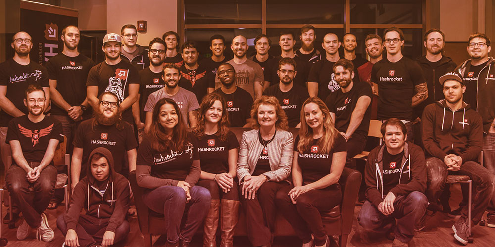

# [PG Casts](https://www.pgcasts.com/)

PG Casts 是关于所有 Postgres 的双周视频系列。 我们的使命是与世界分享我们集体的 Postgres 知识。

PG Casts 由 [Hashrocket 的 Ruby on Rails 顾问团队](https://hashrocket.com/)为您带来。 我们专注于 Ruby on Rails、React、Ember、Elixir、移动设备，当然还有 PostgreSQL。 通过咨询和开源项目，我们已经开始记录一系列提示、技巧和技术，这些已经成为我们工具箱的一部分。 现在我们很高兴与您分享这些内容。 您可以定期看到新的截屏视频，这将帮助您将 Postgres 知识提升到一个全新的水平。

[Hashrocket](https://hashrocket.com/) 是一个由专业设计师和开发人员组成的团队，在杰克逊维尔海滩和芝加哥设有办事处。 自 2008 年以来，我们一直在为我们的客户制作软件、启动项目并提供技术支持。

